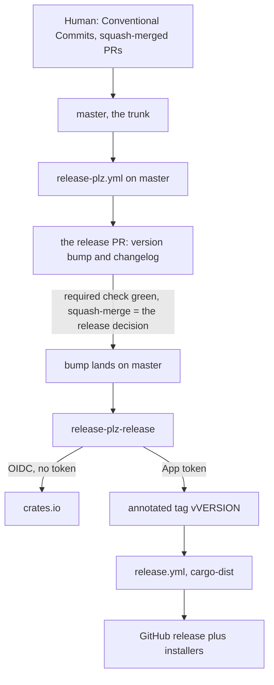
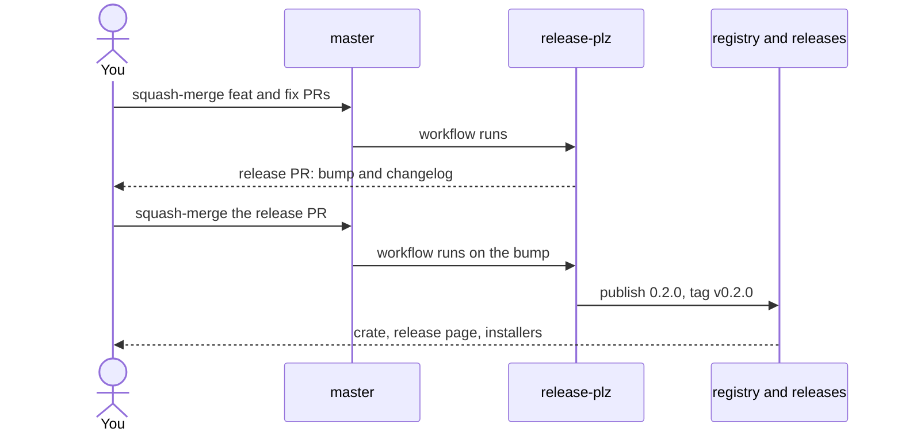

# Release workflow

This page maps the release workflow this repository runs on itself. The procedure lives in the shipped runbooks — `rk guide setup`, `rk guide release`, `rk guide backport` — and every page here is an overlay over them: fill the coordinates in once, and nothing below names a particular account, repository, or crate.

Every page here is operator procedure. An agent reads one to say which step comes next and to check that a step was done, and runs a git, forge, or registry step only where the operator's request named that step.

## Coordinates

The two operating pages open with a shell block exporting these; fill it in once per repository and every command in them runs as written.

- `OWNER`: the account or organization that owns the repository
- `REPO`: the repository name
- `CRATE`: the package name as published to the registry
- `APP`: the bot App's name, setup only
- `APP_ID`: the bot App's numeric id, setup only
- `KEY`: absolute path to the App's `.pem`, outside every repository, setup only

A variable here is something a project is free to choose. Everything the convention fixes is written literally in the runbooks instead, because changing it means changing the payload rather than the page; each entry below names where the payload fixes it.

- Trunk: `master`
  - fixed by `TRUNK_BRANCH` in `src/setup/context.rs`, and by the `branches:` filter in the landed `release-plz.yml`
- Release lines: `release/*`
  - fixed by that same `branches:` filter
- Required checks: `test` and `pr-title`
  - `test` is the job id this project's own CI workflow reports, which `--required-check test` assumes
  - `pr-title` is the job id the landed title check reports, and `setup/github/protect-trunk` requires it beside the first
- Title check: `.github/workflows/pr-title.yml`
  - fixed by the snippet that lands it, and it runs on `pull_request_target` so the forge executes the trunk's copy
- Squash title source: `PR_TITLE`, with `PR_BODY` as the message
  - fixed by `setup/github/protect-trunk`, which sets both on the repository
- Trunk ruleset: `master-protection`
  - fixed by `setup/github/protect-trunk`
- Tag and line rulesets: `release-tags`, `release-lines`
  - fixed by `setup/github/protect-tags` and `setup/github/protect-release-lines`
- Bot secrets: `RELEASE_BOT_APP_ID`, `RELEASE_BOT_APP_PRIVATE_KEY`
  - fixed by the landed `release-plz.yml`
- Publish workflow: `release-plz.yml`
  - fixed by the snippet that lands it
- Artifact workflow: `release.yml`
  - generated by cargo-dist from `dist-workspace.toml`
- Version truth: `Cargo.toml`
  - fixed by release-plz
- Tool pins: `versions.toml`
  - the payload's own registry

## The whole system

One branch, one pull request, one merge button. There is no `develop`, no gate PR, and no back-merge: the bot maintains the release PR against the trunk, and merging it is the release.

## A release, one pull request

## Release gates

- Intent: `feat:` means minor, `fix:` means patch
  - prevents an unintended version
- Release PR: the changelog is corrected on its branch before merge
  - prevents an incomplete immutable entry
- Merge: `test` passes, and squash is the only merge method
  - prevents an unverified release and nonlinear history
- Publisher: crates.io trusts `release-plz.yml`, never `release.yml`
  - prevents the installer workflow becoming the publisher
- Tag: automation writes the annotated immutable tag
  - prevents manual or movable tags
- Done: wait for `release.yml`, then verify registry, assets, two equal SHAs, and provenance — every downloaded asset passes `gh attestation verify`
  - prevents a premature or split-brain handoff, and a release that violates the provenance invariant while reading as verified

## The overlay pages

- [setup.md](./setup.md), once per repository
  - the coordinates over `rk guide setup`, and what this repository already settles
- [release.md](./release.md), every release
  - the coordinates over `rk guide release`, and the proof transcript
