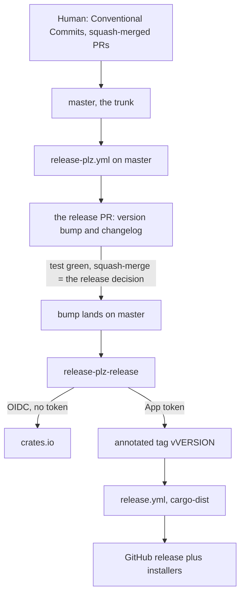
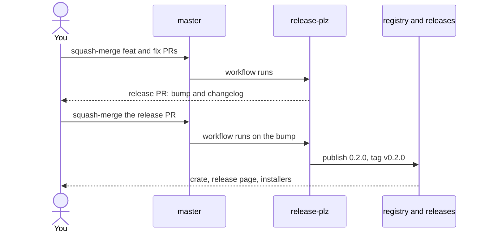

# Release workflow

This page maps this repository's release workflow; the detailed commands are in the linked guides.

## Fixed coordinates

| Fact              | Value                                               |
| ----------------- | --------------------------------------------------- |
| Project           | `gubasso/release-kit`                               |
| Crate             | `release-kit`                                       |
| Trunk             | `master`, the only permanent branch and the default |
| Required check    | `test`                                              |
| Version truth     | `Cargo.toml`                                        |
| Publish workflow  | `release-plz.yml`                                   |
| Artifact workflow | `release.yml`                                       |

## The whole system

One branch, one pull request, one merge button. There is no `develop`, no gate PR, and no back-merge: the bot maintains the release PR against `master`, and merging it is the release.

## A release, one pull request

## Simulated pass: v0.1.0 to v0.2.0

| Step | You do this                                      | Then this happens                                                           |
| ---- | ------------------------------------------------ | --------------------------------------------------------------------------- |
| 1    | Squash-merge a `feat:` PR into `master`          | Nothing releases; release-plz refreshes the release PR to propose `0.2.0`   |
| 2    | Read the changelog on the release PR             | The open PR is the correction window, reviewed like any other diff          |
| 3    | Squash-merge the release PR once `test` is green | The bump lands; `release-plz-release` publishes over OIDC and tags `v0.2.0` |
| 4    | Wait a few minutes                               | The tag starts `release.yml`; cargo-dist builds installers, fills the page  |
| 5    | Verify                                           | `cargo info`, `gh release view`, and `v0.2.0^{commit}` = `origin/master`    |

## Release gates

| Boundary   | Must be true                                                    | Failure prevented                     |
| ---------- | --------------------------------------------------------------- | ------------------------------------- |
| Intent     | `feat:` means minor; `fix:` means patch                         | Unintended version                    |
| Release PR | Changelog corrected on its branch before merge                  | Incomplete immutable entry            |
| Merge      | `test` passes; squash is the only merge method                  | Unverified release, nonlinear history |
| Publisher  | crates.io trusts `release-plz.yml`, never `release.yml`         | Installer workflow as publisher       |
| Tag        | Automation writes the annotated immutable tag                   | Manual or movable tags                |
| Done       | Wait for `release.yml`; verify registry, assets, two equal SHAs | Premature or split-brain handoff      |

## Detailed guides

| Guide                      | When                | Detail                                      |
| -------------------------- | ------------------- | ------------------------------------------- |
| [setup.md](./setup.md)     | Once per repository | The ordered bootstrap steps                 |
| [release.md](./release.md) | Every release       | The operating steps, plus the backport path |
