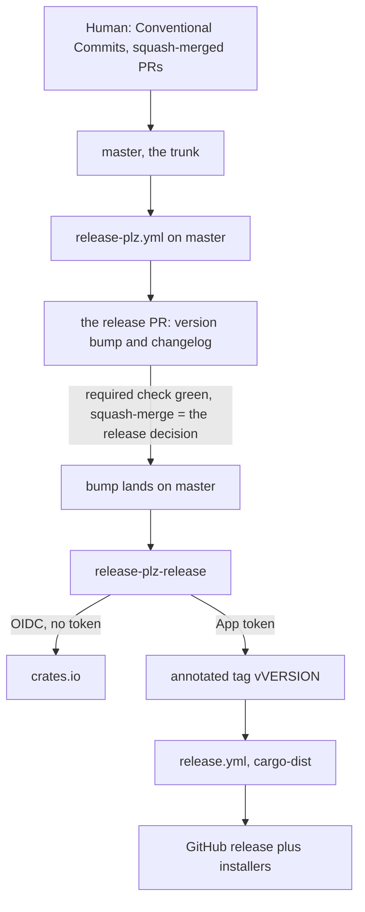
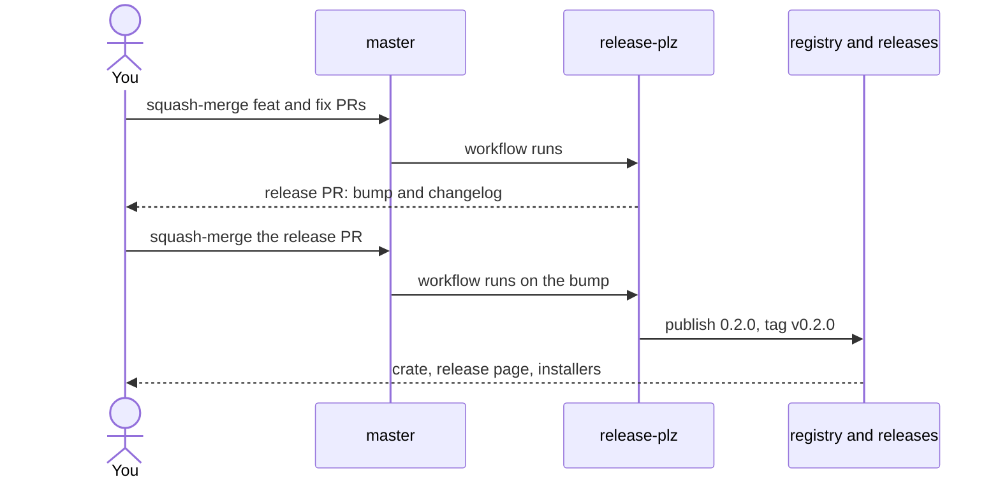

# Release workflow

This page maps the release workflow this repository runs on itself; the detailed commands are in the linked guides. Every page here is parameterized: fill the coordinates in once, and nothing below names a particular account, repository, or crate.

## Coordinates

The two operating pages open with a shell block exporting these; fill it in once per repository and every command in them runs as written.

- `OWNER`: the account or organization that owns the repository
- `REPO`: the repository name
- `CRATE`: the package name as published to the registry
- `APP`: the bot App's name, setup only
- `APP_ID`: the bot App's numeric id, setup only
- `KEY`: absolute path to the App's `.pem`, outside every repository, setup only

A variable here is something a project is free to choose. Everything the convention fixes is written literally in the guides instead, because changing it means changing the payload rather than the page.

Fixed by the convention, not by the project:

- Trunk: `master`, the only permanent branch and the default
- Release lines: `release/*`
- Required check: `test`, the CI workflow's job id
- Version truth: `Cargo.toml`
- Publish workflow: `release-plz.yml`
- Artifact workflow: `release.yml`
- Bot secrets: `RELEASE_BOT_APP_ID`, `RELEASE_BOT_APP_PRIVATE_KEY`
- Trunk ruleset: `master-protection`
- Tag ruleset: `release-tags`
- Line ruleset: `release-lines`

`setup.md` says where the payload fixes each one.

## The whole system

One branch, one pull request, one merge button. There is no `develop`, no gate PR, and no back-merge: the bot maintains the release PR against the trunk, and merging it is the release.

## A release, one pull request

## Simulated pass: v0.1.0 to v0.2.0

1. Squash-merge a `feat:` PR into `master`
   - Nothing releases; release-plz refreshes the release PR to propose `0.2.0`
2. Read the changelog on the release PR
   - The open PR is the correction window, reviewed like any other diff
3. Squash-merge the release PR once `test` is green
   - The bump lands; `release-plz-release` publishes over OIDC and tags `v0.2.0`
4. Wait a few minutes
   - The tag starts `release.yml`; cargo-dist builds installers, fills the page
5. Verify
   - `cargo info`, `gh release view`, and `v0.2.0^{commit}` = `origin/master`

## Release gates

- Intent: `feat:` means minor, `fix:` means patch
  - prevents an unintended version
- Release PR: the changelog is corrected on its branch before merge
  - prevents an incomplete immutable entry
- Merge: `test` passes, and squash is the only merge method
  - prevents an unverified release and nonlinear history
- Publisher: crates.io trusts `release-plz.yml`, never `release.yml`
  - prevents the installer workflow becoming the publisher
- Tag: automation writes the annotated immutable tag
  - prevents manual or movable tags
- Done: wait for `release.yml`, then verify registry, assets, and two equal SHAs
  - prevents a premature or split-brain handoff

## Detailed guides

- [setup.md](./setup.md), once per repository
  - the ordered bootstrap steps
- [release.md](./release.md), every release
  - the operating steps, plus the backport path
